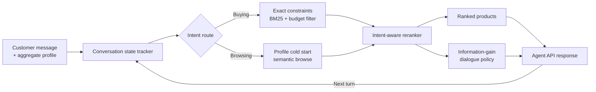

# Conversational E-Commerce Search Agent

**Team Kopi O(1) · Techjam Track 4 Shopping Copilot: AI Conversational Search and Recommendations**

An offline, stateful shopping agent that turns vague multi-turn conversations into ranked product recommendations. The agent asks targeted clarification questions, remembers and updates customer constraints, and tries to identify the hidden target product within 10 turns.

[Public repository](https://github.com/shaohong126/techjam-Kopi-O-1-) · [Data attribution](DATA_ATTRIBUTION.md) · [Agent contract](docs/agent_api_contract.json) · [Submission rules](docs/submission_rules.md)

## Project Overview

Conversational product search is harder than one-shot keyword search. A customer may begin with a broad request, reveal preferences gradually, reject an attribute, set a budget, or change their mind halfway through the conversation. A useful shopping agent must preserve the relevant context while still returning strong recommendations early.

Our solution addresses this problem with a deterministic hybrid retrieval pipeline:

- **Stateful conversation understanding** extracts categories, product constraints, budget ranges, intent, refusals, and preference overrides from every turn.
- **Intent-aware routing** treats exploratory browsing differently from high-intent buying.
- **Hybrid candidate retrieval** combines exact constraint matching, SQLite FTS5/BM25 search, lightweight synonym expansion, category routing, and budget filtering.
- **Multi-signal reranking** uses constraint coverage, sequence alignment, lexical and semantic overlap, price proximity, profile affinity, product quality, popularity, and recency.
- **Adaptive clarification** uses candidate attribute coverage and entropy to choose useful follow-up questions without repeatedly asking about declined preferences.
- **Precision-first recommendation policy** avoids previously shown products and uses a deliberate confidence threshold to return one focused recommendation on turns 1–9, followed by a Top-10 safety net on turn 10.

The final agent runs fully offline with no external API, model download, credential, or network access.

## How It Works



### 1. Conversation state tracking

Each session stores the customer's category, active constraints, budget, intent, asked attributes, declined attributes, and previously recommended products. When the customer changes their mind, conflicting tentative preferences are revoked while independently confirmed facts are preserved.

### 2. Candidate retrieval

The catalog is indexed in an in-memory SQLite FTS5 table over title, category, features, details, store, and description. Depending on the conversation state, retrieval combines:

- exact constraint intersections;
- field-weighted BM25 search;
- hand-built synonym and semantic-term expansion;
- category candidates and profile-based cold-start priors;
- numerical budget filtering.

### 3. Intent-aware reranking

Buying sessions emphasize hard-constraint coverage, exact matches, budget proximity, and purchase priors. Browsing sessions place more weight on profile affinity, semantic similarity, product quality, popularity, and recency.

### 4. Clarification policy

The dialogue policy estimates the information gain of material, color, size, style, brand, budget, use case, and feature attributes from the current candidate pool. It asks a broad question early, then selects a specific high-value attribute when that is more informative.

### 5. Confidence threshold and Top-1 policy

The current version adds query-local confidence scoring and sets `tail_confidence_threshold = 1.01`. Candidate confidence is clamped to `[0, 1]`, so 1.01 is intentionally unreachable: on turns 1–9, the agent returns only the rank-1 product; on turn 10, it bypasses the threshold and returns up to `top_k` products as a final recall safeguard.

This is the main behavioral difference from the earlier confidence-gated version, whose threshold was 0.95 and could admit additional high-confidence products. On the 200-session public development set, strict Top-1 preserved Hit Rate@10 while improving MRR and the weighted technical score:

| Recommendation policy | Hit Rate@10 | MRR | MTTC ↓ | Technical score |
|---|---:|---:|---:|---:|
| **Strict Top-1 (`threshold = 1.01`)** | **1.000** | **1.0000** | 2.02 | **0.9796** |
| Confidence tail at ≥0.99 | 1.000 | 0.9975 | 2.02 | 0.9789 |
| Confidence tail at ≥0.95 | 1.000 | 0.9917 | **2.00** | 0.9775 |
| Up to 10 products every turn | 1.000 | 0.7110 | **1.50** | 0.9033 |

The value 1.01 does **not** mean 101% confidence. It is an objective-specific switch that disables the recommendation tail before the final turn because this competition rewards reciprocal rank more strongly than the small efficiency gain from lower-ranked early hits. A consumer-facing shopping product would likely lower the threshold and show a shortlist instead.

## Technology, APIs, and Data

| Category                | Used in this project                                                                                                        |
| ----------------------- | --------------------------------------------------------------------------------------------------------------------------- |
| Language                | Python 3.10+; verified with Python 3.12.5                                                                                   |
| Development tools       | Python CLI, Git, and GitHub; the code is editor-agnostic                                                                    |
| External APIs           | **None**                                                                                                                    |
| Libraries/frameworks    | Python standard library only: `sqlite3`/FTS5, `json`, `re`, `math`, `dataclasses`, `collections`, `pathlib`, and `unittest` |
| LLMs / embedding models | None in the submitted agent                                                                                                 |
| Dataset                 | [Amazon Reviews 2023](https://amazon-reviews-2023.github.io/), `Clothing_Shoes_and_Jewelry`, from McAuley Lab at UCSD       |
| Local evaluation data   | 50,000 catalog products and 200 labeled development sessions                                                                |
| Media assets            | None; the solution uses only text and structured product metadata                                                           |

The 200 public sessions comprise 80 Buying, 80 Browsing, 30 Intent Override, and 10 Boundary sessions. The organizer retains an additional 800 sessions for private evaluation. Raw user IDs, review text, timestamps, and purchase histories are not included in this repository. See [DATA_ATTRIBUTION.md](DATA_ATTRIBUTION.md) and [data/README.md](data/README.md) for provenance and permitted use.

## Repository Structure

```text
.
├── data/
│   ├── public_set.jsonl          # 200 labeled development sessions
│   └── catalog.jsonl             # Frozen catalog of 50,000 products
├── docs/
│   ├── agent_api_contract.json   # Machine-readable response contract
│   ├── baseline_results.json     # Weak BM25 baseline
│   ├── competition_specification.md
│   ├── evaluation_config.json
│   └── submission_rules.md
├── evaluator/
│   └── local_evaluator.py        # Deterministic simulator and scorer
├── starter/
│   ├── agent.py                  # Agent entry point and orchestration
│   ├── dialogue.py               # Clarification-question policy
│   ├── models.py                 # Session and retrieval data models
│   ├── ranking.py                # Intent-aware reranking
│   ├── retrieval.py              # FTS5 index and candidate retrieval
│   └── understanding.py          # Constraint and intent tracking
├── tests/
│   ├── test_agent.py
│   └── test_evaluator.py
├── DATA_ATTRIBUTION.md
└── README.md
```

## Setup and Installation

### Prerequisites

- Python 3.10 or later
- A Python build whose bundled SQLite supports FTS5 (included in standard CPython builds)
- Git
- About 70 MB of free disk space for the catalog and evaluation output

No `pip install`, environment variable, API key, or external service is required.

### 1. Clone the repository

```bash
git clone https://github.com/shaohong126/techjam-Kopi-O-1-.git
cd techjam-Kopi-O-1-
```

Creating a virtual environment is optional because the project has no third-party dependencies:

```bash
python -m venv .venv
```

Activate it with `source .venv/bin/activate` on macOS/Linux or `.venv\Scripts\Activate.ps1` in PowerShell.

### 2. Verify the catalog

The frozen catalog is included at `data/catalog.jsonl`. Confirm that it contains 50,000 rows:

```bash
python -c "from pathlib import Path; print(sum(1 for _ in Path('data/catalog.jsonl').open(encoding='utf-8')))"
```

## Run and Reproduce the Results

All commands below should be run from the repository root.

### 1. Run the test suite

```bash
python -m unittest discover -s tests -v
```

Expected result: all 13 tests pass. The tests cover buying/browsing routing, paraphrased constraints, budgets, intent overrides, boundary responses, semantic synonyms, confidence-threshold behavior, recommendation limits, and evaluator behavior.

### 2. Run the public evaluator

```bash
python -m evaluator.local_evaluator
```

The evaluator reads `data/catalog.jsonl` and `data/public_set.jsonl`, prints aggregate and scenario-level metrics, and writes per-session results to `results.json`.

Optional custom paths:

```bash
python -m evaluator.local_evaluator \
  --catalog data/catalog.jsonl \
  --dataset data/public_set.jsonl \
  --output results.json
```

### 3. Expected public-set results

The current source was re-evaluated on all 200 public sessions with Python 3.12.5:

| Metric          | Weak BM25 baseline | Current agent |
| --------------- | -----------------: | ------------: |
| Hit Rate@10     |              0.125 |     **1.000** |
| MRR             |           0.068034 |     **1.000** |
| MTTC ↓          |               9.81 |      **2.02** |
| Efficiency      |              0.119 |     **0.898** |
| Technical score |            0.10671 |    **0.9796** |

Scenario breakdown:

| Scenario        | Sessions | Hit Rate@10 |   MRR | MTTC ↓ |
| --------------- | -------: | ----------: | ----: | -----: |
| Buying          |       80 |       1.000 | 1.000 |  1.500 |
| Browsing        |       80 |       1.000 | 1.000 |  1.825 |
| Intent Override |       30 |       1.000 | 1.000 |  3.733 |
| Boundary        |       10 |       1.000 | 1.000 |  2.600 |

The technical score is calculated as:

```text
TechnicalScore = 0.50 × HitRate@10 + 0.30 × MRR + 0.20 × Efficiency
Efficiency = clip((11 - MTTC) / 10, 0, 1)
```

These figures are local development results on the released deterministic simulator. They do **not** guarantee equivalent performance on the organizer's private sessions or real customer conversations.

## Agent Interface

The evaluator imports `Agent` from `starter/agent.py` and calls:

```python
class Agent:
    def reset(self, session_id: str, user_profile: dict) -> None:
        ...

    def respond(
        self,
        session_id: str,
        user_message: str,
        turn: int,
        top_k: int,
    ) -> dict:
        return {
            "message": "What other requirement should I prioritize?",
            "ask_attribute": "other",
            "recommendations": [{"parent_asin": "B000..."}],
            "usage": {"prompt_tokens": 0, "completion_tokens": 0},
        }
```

`ask_attribute` may be `category`, `material`, `color`, `size`, `style`, `brand`, `budget`, `feature`, `use_case`, `other`, or `null`. Only the first 10 valid unique `parent_asin` values are scored.

## Runtime, Network, and Cost Disclosure

- **Network access:** not required.
- **Required environment variables:** none.
- **Prompt/completion tokens:** 0.
- **External API cost:** USD 0.
- **Model inference:** none.
- **Observed evaluation time:** approximately 19.3 seconds for all 200 public sessions, including catalog indexing, on the development machine. Runtime is hardware-dependent.

## Demo

A public YouTube walkthrough will be added here and linked in the Devpost submission before the deadline.

The demo will show:

1. environment and catalog setup;
2. an end-to-end multi-turn shopping session;
3. budget, intent-override, and boundary behavior;
4. the local evaluator command and final metrics.

## Design Decisions and Experiments

The highest-impact decision in the agent is **how many products to return per
turn**, and it is the one we tested most carefully.

The interface permits up to 10 ids, but scoring uses reciprocal rank. Returning
one high-confidence candidate scores `RR = 1.0` when correct; returning ten with
the target at position four scores 0.25. We therefore return **one** candidate on
turns 1–9, falling back to all ten on turn 10 as a last-chance safety net.
Previously shown ids are excluded, so a wrong guess costs exactly one turn and
the next-best candidate is offered instead.

We did not assume this was right. The agent computes a calibrated confidence for
every candidate, and `tail_confidence_threshold` controls how much of the ranked
tail is revealed alongside the top pick. Sweeping it end to end:

| Tail threshold        | MRR       | MTTC      | Efficiency | Score      |
| --------------------- | --------- | --------- | ---------- | ---------- |
| 0.00 (admit all ten)  | 0.7110    | **1.500** | **0.9500** | 0.9033     |
| 0.10 – 0.40           | 0.8421    | 1.735     | 0.9265     | 0.9379     |
| 0.50                  | 0.8677    | 1.765     | 0.9235     | 0.9450     |
| 0.60                  | 0.9067    | 1.825     | 0.9175     | 0.9555     |
| 0.70                  | 0.9283    | 1.865     | 0.9135     | 0.9612     |
| 0.80                  | 0.9604    | 1.935     | 0.9065     | 0.9694     |
| 0.90                  | 0.9842    | 1.985     | 0.9015     | 0.9756     |
| 0.95                  | 0.9917    | 2.000     | 0.9000     | 0.9775     |
| 0.98                  | 0.9950    | 2.010     | 0.8990     | 0.9783     |
| 0.99                  | 0.9975    | 2.015     | 0.8985     | 0.9789     |
| **1.01 (admit none)** | **1.000** | 2.020     | 0.8980     | **0.9796** |

Hit Rate@10 is **1.000 at every point on this curve**. That is the crux: with no
missed targets left to recover, every additional candidate is pure rank dilution.
Loosening the gate buys exactly what it should — MTTC falls 2.020 → 1.500,
efficiency rises 0.898 → 0.950 — and pays more than it earns at every step. A
0.52-turn speed-up costs 0.076 of technical score.

The reason is structural rather than a tuning failure. An extra candidate can
only change the outcome two ways: either it **is** the target, converting a turn
earlier but at rank ≥2 (gaining `0.20 × 0.1` in efficiency, losing `0.30 × 0.5`
in reciprocal rank), or it **isn't**, in which case it is consumed and cannot be
offered later. No branch favours hedging.

We ship `tail_confidence_threshold = 1.01`, deliberately unreachable because
confidence is clamped to `[0, 1]`. **This maximises the technical score under the
competition's weighting, but it is not universally correct.** A deployment that
valued reaching an answer quickly, or that showed shoppers a shortlist rather
than one suggestion, would lower it on purpose and accept the ranking cost. The
parameter is exposed rather than hard-coded so that choice remains open.

One incidental finding: thresholds from 0.10 to 0.40 produce byte-identical
results, because no candidate's confidence ever falls in that band. The scoring
function separates confident from unconfident candidates cleanly with little mass
in between — which is what makes a single-candidate probe viable at all.

## Limitations and Future Improvements

### Current limitations

- The language understanding layer relies on English regular expressions, fixed vocabulary, and a small hand-built synonym map. Unseen phrasing, spelling mistakes, and multilingual messages may be misinterpreted.
- The so-called semantic route uses token expansion and set-overlap similarity, not learned embeddings or a transformer model.
- Ranking weights and dialogue behavior were evaluated on the public simulator, so the strong public score may partly reflect simulator-specific wording and catalog structure.
- The entire 50,000-product FTS5 index is rebuilt in memory at startup. This is simple and fast at the current scale but will not scale efficiently to millions of frequently changing products.
- The project currently provides an evaluator/API workflow rather than a consumer-facing interface, and it has not yet been validated through a real-user study.

### Given more time, we would

- create a held-out paraphrase and adversarial test set to measure generalization beyond the public simulator;
- add typo-tolerant, multilingual constraint extraction and stronger preference-override handling;
- compare offline embedding retrieval and learning-to-rank against the deterministic fallback;
- persist the search index and benchmark startup time, per-turn latency, memory use, and catalog-update performance;
- build a lightweight web interface and conduct user testing on question usefulness and recommendation quality.

## Data Attribution

This project uses **Amazon Reviews 2023**, published by McAuley Lab at UCSD, specifically the `Clothing_Shoes_and_Jewelry` category. The repository contains text and structured metadata only and does not include product images, videos, account credentials, raw review histories, or private organizer labels.

Please review [DATA_ATTRIBUTION.md](DATA_ATTRIBUTION.md) before using or redistributing the data.

## Team Member Contributions
Team Member: Cayla Cheok Kang Ling, Chew Shao Hong, Keh Jing Xiang, Liew Shan Xuan, Wong Ying Jia

All team members contributed collaboratively throughout the project, including solution design, implementation, testing, evaluation, and documentation. As the work was completed jointly through continuous discussion and iteration, individual contributions were not divided into strictly separate components.
